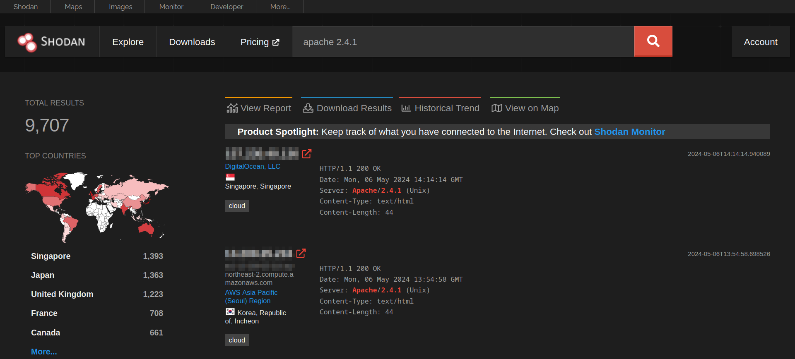
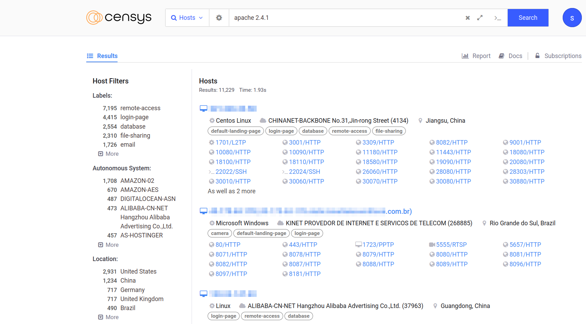
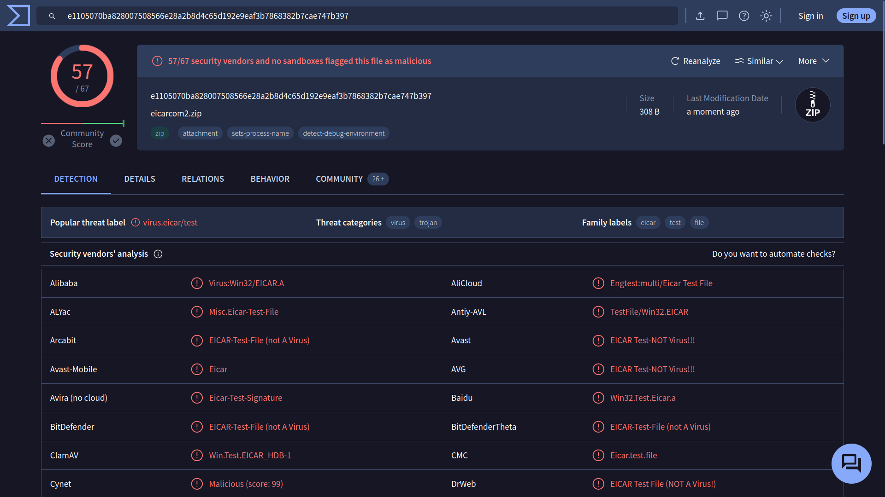
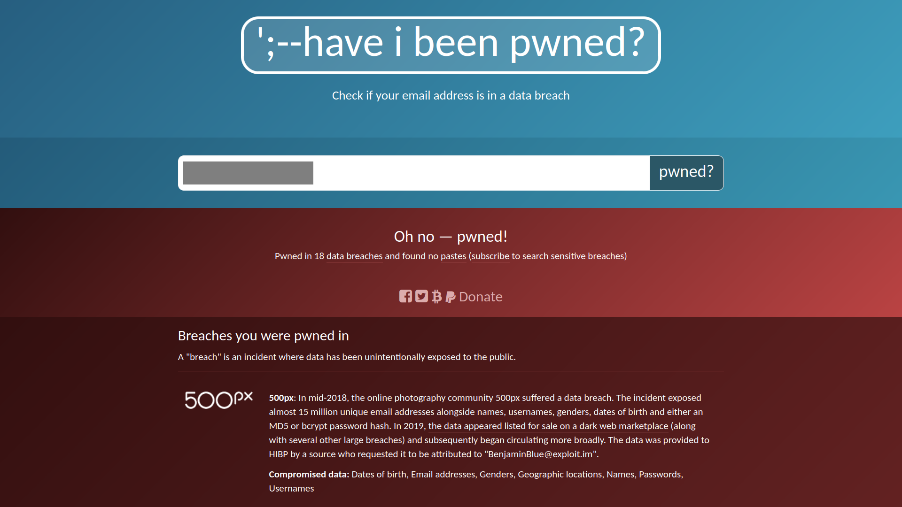

# Search Skills
I went through some public search engines and their [advanced search operators list](https://github.com/cipher387/Advanced-search-operators-list).

Then, some specialized search engines like [Shodan](https://www.shodan.io/search/examples)

, [Censys](https://search.censys.io/) and its [use cases](https://docs.censys.com/docs/ls-introductory-use-cases),

, [VirusTotal](https://www.virustotal.com/gui/home/upload)

and [Have I Been Pwned](https://haveibeenpwned.com/)

**About CVE** (Common Vulnerabilities Exposures), The MITRE Corporation maintains the CVE system. We can visit site [CVE Program](https://www.cve.org/) or [NVD (National Vulnerability Database)](https://nvd.nist.gov/) for more details.

To exploit database, we must have permission, usually via a legally binding agreement. Some resource for a working exploit code is [Exploit Database](https://www.exploit-db.com/) and [Github](https://github.com/).