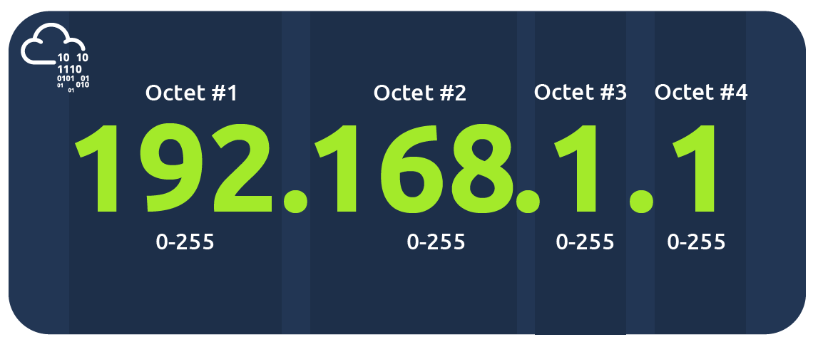
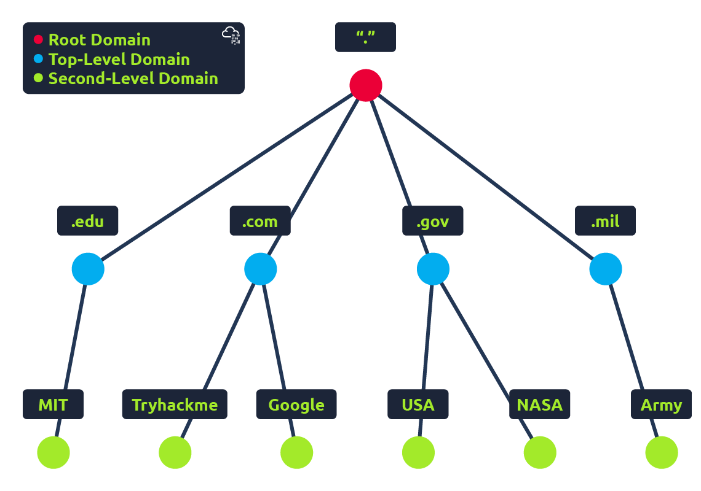
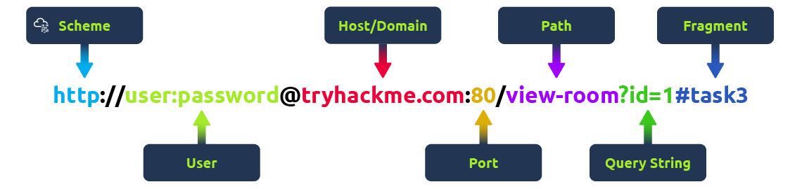
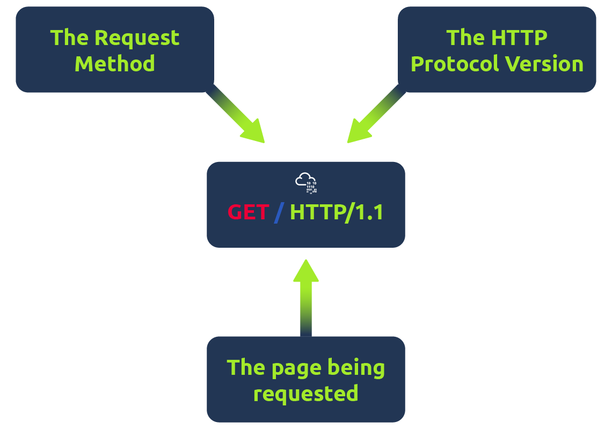
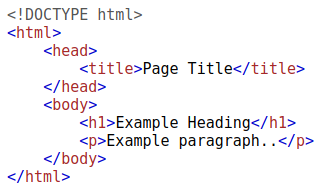

# Offensive Security Intro
I learned how to use gobuster to fuzz URLs, for example:

`(base) ➜  workspace git:(main) ✗ gobuster dir -u https://www.kali.org/ -w rockyou.txt`

# Defensive Security Intro
I know some definitions about blue team like SOC, DFIR, malware,...
Also learn how to basically trace logs:

`inspect alerts -> check IP malicious or not -> contact with responsible people -> if can, block that IP`

# Careers in Cyber
I know the learning path leads to each careers related to security.

# What is Networking?
- Know private network and the networks connecting these small networks are called public networks -- or the Internet.
- To communicate and maintain order, devices must be both identifying and identifiable on a network. Therefore, each device uses: IP Address and a Media Access Control (MAC) Address -- like serial number.
## IP Addresses



A public address is used to identify the device on the Internet, whereas a private address is used to identify a device amongst other devices. Here we have two devices on a private network:

| Device Name     | IP Address   | IP Address Type |
| --------------- | ------------ | --------------- |
| DESKTOP-KJE57FD | 192.168.1.77 | Private         |
| DESKTOP-KJE57FD | 86.157.52.21 | Public          |
| CMNatic-PC      | 192.168.1.74 | Private         |
| CMNatic-PC      | 86.157.52.21 | Public          |


These two devices use their private IP addresses to communicate with each others, while any data sent to the Internet will be identified by the same public IP address.
Public IP address are given by our Internet Service Provider (or ISP) at a monthly fee (our bill!!!)


One version of the Internet Protocol addressing scheme known as IPv4, which can go up to $2^{32}$ IP addresses (4.29 billion) -- too small to satisfy the needs.

IPv6 is a new iteration to help tackle this issue: supports up to $2^{128}$ of IP addresses and more efficient due to new metholodogies.


## MAC Addresses
All devices have a physical network interface, which is a microchip board found on the device's motherboard. This network interface is assigned a unique address factory it was built at, called a MAC (Media Access Control) address.

The MAC Address is a twelve-char hex number split into two's and separated by a colon which is considered separators. The first six chars represents the company that made the network interface, and the last six is a unique number.


However, an interacting things with MAC addresses is that they can be faked or 'spoofed' in a process known as spoofing.

Places such as cafes, coffee shops, and hotels alike often use MAC address control when using their "Guest" or "Public" Wi-fi. This configuration could offer better services, i.e. a faster connection for a price if you are willing to pay the fee per device.

## Ping (ICMP)
Ping uses ICMP (Internet Control Message Protocol) packets to determine the performance of a connection between devices, i.e. if the connection exists or is reliable.

The syntax to do a simple ping is: `ping IP address or website URL`.


Here we are pinging a device that has the private address of 192.168.1.254. Ping informs us that we have sent six ICMP packets, all of which were received with an average time of 4.16 miliseconds. 

# DNS in Detail
DNS (Domain Name System) provides a simple way to communicate with devices on the Internet without remember complexing numbers, which is IP addresses. So instead of remembering 132.12.13.109, you can remember [r1muru2006.github.io](https://r1muru2006.github.io/) instead.

## Domain Hierarchy

TLD (Top-Level Domain) includes gTLD (Generic Top Level) and ccTLD (Country Code Top Level).
Second-Level Domain is the part `tryhackme` in `tryhackme.com`, while `.com` part is the TLD. SLD is limited to 63 characters + the TLD and can only use `a-z 0-9` and hyphens (not start or end with hyphens or have consecutive hyphens)

Subdomain sits on the left-hand side of the SLD using a period to separate it, i.e. `admin.tryhackme.com` has the subdomain is `admin`. A subdomain name has the same creation restrictions as a SLD. There is no limit to the number of subdomains in a domain name, but the length must be kept to 253 chars or less, i.e. `ronaldo.messi.football.world-cup.youtube.com`.

## DNS Record Types

- A Record: Resolve to IPv4 addresses.
- AAAA Record: Resolve to IPv6 addresses.
- CNAME Record: Resolve to another domain name.
- MX Record: Resolve to the address of the servers that handle the email for the domain you are querying.
- TXT Record: Free text fields where any text-based data can be stored.

## Making a request


- First, the computer checks its local cache to see if the address were previously looked up recently; if not, a request to Recursive DNS server will be made.
- A Recursive DNS Server is usually provided by our ISP. This server also has a local cache of recently looked up domain names, If a result found, this is sent back to the computer, and our request ends here. If not, it starts with the internet's root DNS servers to find the right answers.
- Then, the root servers redirect us to the correct TLD Server.
- This TLD server holds records for where to find the authoritative server (also known as the nameserver for the domain) to answer the DNS request. There are often multiple nameservers for a domain name to act as a backup in case one goes down.
- Finally, the DNS records is stored in the authoritative DNS server for each particular domain name and also their updates. This record is sent back to the Recursive DNS Server, where a local copy will be cached for future requests and then relayed back to the original client.

**NOTE**: DNS records all come with a TTL (Time To Live) value, which is a number represents in seconds that the response should be saved for locally until we have to look it up again. Caching saves on having to make a DNS request everytime we communicate with a server.

# HTTP in Detail

HTTP (HyperText Transfer Protocol) is what's used whenever you view a website. It is the set of rules used for communicating with web server for the transmitting of webpage data, whether that is HTML, Images, Videos, etc.

HTTPS (HTTP Secure) is the secure version of HTTP. Its data is encrypted in order to stopping people from seeing our data and also giving the assurances that we are taking the correct web server and not something impersonating it.

## URL (Uniform Resource Locator)
A URL is predominantly an instruction on how to access a resource on the internet.



**Making a Request**: It's possible to make a request to a web server with just one line **GET / HTTP/1.1**



**Example Request:**
```text
GET / HTTP/1.1

Host: tryhackme.com
User-Agent: Mozilla/5.0 Firefox/87.0
Referer: https://tryhackme.com/
```
Note: HTTP requests always end with a blank line to inform the web server that the request has finished.

**Example Response:**
```text
HTTP/1.1 200 OK

Server: nginx/1.15.8
Date: Fri, 09 Apr 2021 13:34:03 GMT
Content-Type: text/html
Content-Length: 98


<html>
<head>
    <title>TryHackMe</title>
</head>
<body>
    Welcome To TryHackMe.com
</body>
</html>
```

## HTTP Methods
HTTP methods are a way for the client to show their intended action when making an HTTP request. For example, some HTTP methods commonly are:
- **GET Request**: getting information from a web server.
- **POST Request**: submitting data to the web server and potentially creating new records.
- **PUT Request**: submitting data to a web server to update information.
- **DELETE Request**: deleting information/records from a web server.

## HTTP Status Codes
Status codes can be broken down into 5 different ranges:

| Status code range   | Description |
| ------------------- | ----------- |
| 100-199 - Information Response | The first part of request has been accepted and we should continue sending the rest of the request. These codes are no longer very common. |
| 200-299 - Success       | Telling the client their request was successful |
| 300-399 - Redirection   | Redirecting the client's request to another resource. |
| 400-499 - Client Errors | Alerting the client that there was an error in request. |
| 500-599 - Server Errors | Reversing for errors happening on the server-side. |

## Common HTTP Status Codes
| Status code     | Description   |
| --------------- | ------------ |
| 200 - OK | The request was completed successfully. |
| 201 - Created | A resource has been created. |
| 301 - Moved Permanently | Redirecting the client's browser to a new webpage. |
| 302 - Found | Similar to the above code, but this is only a temporary change. |
| 400 - Bad Request | The request has something wrong or missing. |
| 401 - Not Authorised | Must have authorised with the web application to view this resource.
| 403 - Forbidden | Whether logged in or not, you don't have permission to view this resource.
| 405 - Method Not Allowed | The resource does not allow this method request. |
| 404 - Page Not Found | The page/resource you have requested does not exist. |
| 500 - Internal Service Error | The server doesn't know how to handle properly some kind of error in request. |
| 503 - Service Unavailable | The server is either overloaded or down for maintenance. |
## Headers
Headers are additional bits of data you can send to the web server when making requests.

**Common Request Headers** (from the client to the server)
- **Host**: Telling the web server which website is being requested.
- **User-Agent**: This is our browser software and version number.
- **Content-Length**: Telling the web server how much data expect in the request.
- **Accept-Encoding**: Telling the web server what types of compression methods the browser supports.
- **Cookie**: Data sent to the server to help remember our information.

**Common Response Headers** (from the server to the client after a request)
- **Set-cookie**: Info to store which gets sent back to the web server on each request.
- **Cache-Control**: How long to store the content of the response in the browser's cache before it is requested again.
- **Content-Type**: Telling the client what type of data is being returned, i.e., HTML, CSS, Images, etc.
- **Content-Encoding**: What method has been used to compress the data to make it smaller.
## Cookies


Cookies can be used for many purposes but are most commonly used for website authentication. The cookie value is often a token (unique secret code that isn't easily humanly guessable).
# How Websites Work


There are two major components that make up a mistake:
1. Front End (Client-Side) - the way your browser renders a website.
2. Back End (Server-Side) - a server that processes your request and returns a response.

## HTML
HyperText Markup Language (HTML) is the language websites are written in. Elements (also known as tags) are the building blocks of HTML pages and tells the browser how to display content.


## JavaScript
JavaScript (JS) is used to control the functionality of web pages - without JS, a page would not have interactive elements and would always be static.

```java
<!DOCTYPE html>
<html>
    <head>
        <title>TryHackMe Editor</title>
    </head>
    <body>
        <div id="demo">Hi there!</div>
         <button onclick='document.getElementById("demo").innerHTML = "Button Clicked";'>Click Me!</button>
        <script type="text/javascript">
            document.getElementById("demo").innerHTML = "Hack the Planet";
        </script>
    </body>
</html>
```
## Sensitive Data Exposure
Sensitive Data Exposure occurs when a website doesn't properly protect (or remove) sensitive clear-text information to the end-user; usually found in a site's frontend source code.
## HTML Injection


When a user has control of how their input is displayed, they can submit HTML (or JavaScript) code, and the browser will use it on the page, allowing the user to control the page's appearance and functionality.

